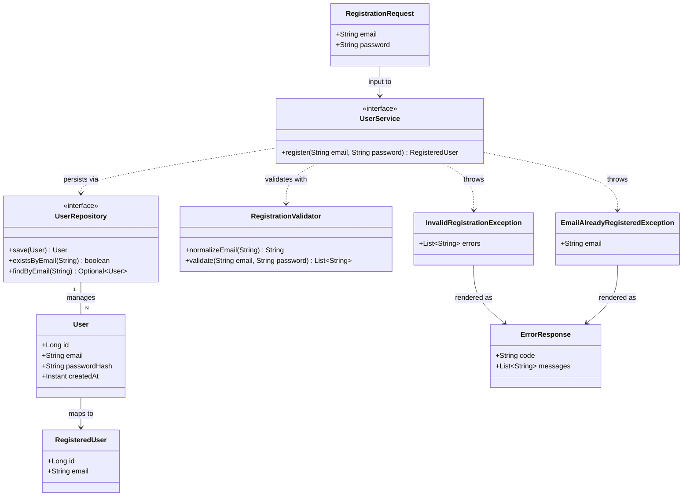

# User Registration (email + password) — HTML page + RESTful API

## Requirements

Implement user registration for the application: allow a person to create an account by submitting an email and a password from a simple HTML page that calls a RESTful API. Enforce syntactic email validity (no reachability verification), a strict password policy (8–32 characters; must contain uppercase, lowercase, digit, and ASCII special characters), case-insensitive email identity with a conflict error on duplicates, and one-way hashed password storage in an H2-backed relational store. Establish the project's layering conventions in the process — entity code, data-access code, and a well-defined service interface must be cleanly separated — and reach 100% test coverage of the feature's domain logic using Hegel property-based tests as the primary style.

Boundaries: no email confirmation/activation flow, no login/authentication, no session management, no UI framework or template engine, no non-H2 database configuration.

## Entities

Notes:

- `User` is the only persistent entity (JPA, table name `users` — `user` is a reserved word in H2). `email` stores the **normalized** (trimmed, lowercased) value and carries a unique constraint. `passwordHash` stores only the BCrypt hash.
- `UserRepository` extends Spring Data's base `Repository<User, Long>` marker (NOT `JpaRepository`) and declares only the three methods above. This keeps the data-access contract narrow and lets tests provide a trivial in-memory fake — which is how Hegel property tests avoid shared-database state contamination.
- `RegistrationRequest` and `RegisteredUser`/`ErrorResponse` are web-layer DTOs; the service interface deliberately takes raw `(email, password)` strings so the domain contract does not depend on web DTOs.

## Approach

1. Architecture / API design:
   - Thin vertical slice with strict layering: static HTML page → `RegistrationController` (REST) → `UserService` interface → `UserServiceImpl` → `UserRepository` → H2. All business rules live in the service layer (validator + service impl); the controller only adapts HTTP, and the page carries zero business logic.
   - API: `POST /api/users` with a JSON body `{"email", "password"}`. Success → `201 Created` with `RegisteredUser` body. Validation failure → `400` with `ErrorResponse{code: "VALIDATION_ERROR"}`. Duplicate email → `409` with `ErrorResponse{code: "EMAIL_ALREADY_REGISTERED"}`. Rationale: 201 is the natural 2xx for resource creation; 409 is the stakeholder-mandated conflict.
   - Static page served from Spring Boot's `static/` resources at `/register.html` — form + minimal fetch-based JavaScript; shows a success screen on 2xx and renders returned error messages otherwise.

2. Technical implementation:
   - Persistence: Spring Data JPA + in-memory H2 (`spring-boot-starter-data-jpa`, `com.h2database:h2` runtime). Schema generated from the entity (embedded-DB default `create-drop`); the unique constraint on `users.email` is declared on the entity so duplicate protection holds at the storage level, not just via pre-check.
   - Password hashing: `spring-security-crypto` only (no full Spring Security starter — it would auto-secure endpoints and add out-of-scope login machinery). A `PasswordEncoder` bean (`BCryptPasswordEncoder`) is provided by a small `@Configuration` class and injected into the service. The 32-char password cap is enforced before hashing, keeping inputs far below BCrypt's ~72-byte truncation limit.
   - Exception handling: dedicated business exceptions (`InvalidRegistrationException`, `EmailAlreadyRegisteredException`) thrown by the service, translated to HTTP by a `GlobalExceptionHandler` (`@RestControllerAdvice`) into the unified `ErrorResponse` format. Malformed/unreadable JSON also maps to `400 VALIDATION_ERROR`.
   - Coverage: JaCoCo Gradle plugin with a `jacocoTestCoverageVerification` rule requiring 100% line and branch coverage of the domain package `com.antithesis.springhegel.user` (web adapters `user.web`, configuration, and the bootstrap class are excluded — they are wiring, not domain logic — but still exercised by tests).

3. Business logic (canonical registration pipeline, in order):
   - **Trim**: `null` inputs are treated as empty; leading/trailing whitespace is stripped from both email and password.
   - **Normalize email**: lowercase the trimmed email using `Locale.ROOT` (ASCII-deterministic; locale-independent).
   - **Validate** (collect ALL failures, not fail-fast — the page can show every problem at once):
     - Email: non-blank; at most 254 characters; after normalization must match `^[a-z0-9._%+-]+@[a-z0-9-]+(\.[a-z0-9-]+)+$` (pragmatic rule: dot-separated domain with at least two labels; no full RFC 5322). Non-ASCII letters survive lowercasing as non-ASCII and therefore fail the pattern — rejected by design.
     - Password: non-blank; 8–32 characters inclusive (after trimming); every character must be printable ASCII (0x20–0x7E; interior spaces are legal but satisfy no class); must contain at least one of each: uppercase `A-Z`, lowercase `a-z`, digit `0-9`, and special character from the set `!"#$%&'()*+,-./:;<=>?@[\]^_`{|}~` (all 32 printable ASCII non-alphanumeric, non-space characters).
   - **Reject on validation failure**: throw `InvalidRegistrationException` carrying the full message list.
   - **Uniqueness**: `existsByEmail(normalizedEmail)` → if present, throw `EmailAlreadyRegisteredException`. Additionally, a `DataIntegrityViolationException` from `save(...)` (the concurrent-registration race) is caught and rethrown as `EmailAlreadyRegisteredException` — the DB unique constraint is the true guarantee.
   - **Hash & persist**: encode the trimmed password with the injected `PasswordEncoder`, save `User(normalizedEmail, hash, now)`, return `RegisteredUser(id, normalizedEmail)`.

4. Testing strategy (Hegel-first):
   - `RegistrationValidator` is a pure component — the bulk of the domain rules — property-tested exhaustively with Hegel generators (valid/invalid emails, policy-satisfying/violating passwords, boundary lengths 8 and 32, missing character classes, non-ASCII rejection, trim behavior).
   - `UserServiceImpl` is property-tested with a hand-rolled `InMemoryUserRepository` fake (possible because `UserRepository` is a narrow 3-method interface) and a low-strength `BCryptPasswordEncoder(4)` for speed. A fresh fake per draw eliminates the Hegel×Spring shared-state contamination risk — no Spring context in property tests at all.
   - HTTP wiring (201/400/409 mapping, JSON contract, static page presence) is covered by a plain example-based `@SpringBootTest` + `MockMvc` test — wiring, not domain logic, per project conventions.

## Structure

### Inheritance Relationships

1. `UserService` interface defines the registration contract (`register(email, password): RegisteredUser`)
2. `UserServiceImpl` implements `UserService`
3. `UserRepository` interface extends `org.springframework.data.repository.Repository<User, Long>` (narrow contract; Spring Data provides the runtime implementation)
4. `InvalidRegistrationException` extends `RuntimeException`
5. `EmailAlreadyRegisteredException` extends `RuntimeException`
6. Test-only: `InMemoryUserRepository` implements `UserRepository`

### Dependencies

1. `RegistrationController` injects `UserService` (the interface, never the impl)
2. `UserServiceImpl` depends on `UserRepository`, `RegistrationValidator`, and `PasswordEncoder`
3. `RegistrationValidator` has no dependencies (pure component)
4. `GlobalExceptionHandler` depends on nothing (stateless translation)
5. `PasswordConfig` provides the `PasswordEncoder` bean

### Layered Architecture

1. Presentation Layer: `static/register.html` — form UI, fetch call, success screen; no business rules
2. Controller Layer: `RegistrationController` (`user.web`) — HTTP/JSON adaptation only; delegates to the service interface
3. Service Layer: `UserService` + `UserServiceImpl` (`user`) — owns the registration pipeline: trim, normalize, validate, uniqueness, hash, persist
4. Domain Support: `RegistrationValidator` (`user`) — pure validation/normalization rules
5. Repository Layer: `UserRepository` (`user`) — narrow data-access contract implemented by Spring Data JPA
6. Entity Layer: `User` (`user`) — JPA entity with the unique email constraint
7. Exception Handling Layer: `GlobalExceptionHandler` (`user.web`) — unified `ErrorResponse` rendering for business exceptions and unreadable requests

Package layout under `com.antithesis.springhegel`:

- `user` — `User`, `UserRepository`, `UserService`, `UserServiceImpl`, `RegistrationValidator`, `RegisteredUser`, `InvalidRegistrationException`, `EmailAlreadyRegisteredException` (domain: 100% coverage target)
- `user.web` — `RegistrationController`, `GlobalExceptionHandler`, `RegistrationRequest`, `ErrorResponse` (wiring: excluded from the 100% rule, still tested)
- `config` — `PasswordConfig`

## Operations

Execute in this order (each step depends only on previous ones).

### Operation 1 — Update Build Configuration - `build.gradle.kts`

1. Responsibility: add the dependencies and coverage tooling this feature needs; nothing speculative.
2. Changes:
   - Add plugin: `jacoco`, pinning `jacoco { toolVersion }` to a release that supports Java 25 class files (0.8.14)
   - Add dependencies:
     - `implementation("org.springframework.boot:spring-boot-starter-data-jpa")`
     - `implementation("org.springframework.security:spring-security-crypto")`
     - `runtimeOnly("com.h2database:h2")`
   - Wire coverage: `tasks.test { finalizedBy(tasks.jacocoTestReport) }`; `tasks.jacocoTestReport { dependsOn(tasks.test) }`
   - Add `tasks.jacocoTestCoverageVerification`: rule with `element = "CLASS"`, includes `com.antithesis.springhegel.user.*`, excludes `com.antithesis.springhegel.user.web.*`; two limits — `LINE` counter `COVEREDRATIO` minimum `1.0` and `BRANCH` counter `COVEREDRATIO` minimum `1.0`. Make `check` depend on `jacocoTestCoverageVerification`.
3. Constraints: do NOT remove the existing Hegel dependency or the `--enable-native-access=ALL-UNNAMED` test JVM arg; do NOT add `spring-boot-starter-security`.

### Operation 2 — Update Configuration - `application.properties`

1. Responsibility: name the H2 datasource explicitly so runtime behavior is documented, and expose nothing else.
2. Content to add:
   - `spring.datasource.url=jdbc:h2:mem:springhegel`
   - `spring.jpa.open-in-view=false`
3. Constraints: in-memory H2 only; rely on the embedded-database default `create-drop` DDL — do not configure a file-backed DB or migrations.

### Operation 3 — Create Business Exception - `InvalidRegistrationException`

1. Package: `com.antithesis.springhegel.user`
2. Inheritance: extends `RuntimeException`
3. Attributes:
   - `errors`: `List<String>` — all validation failure messages (immutable copy)
4. Constructors: `InvalidRegistrationException(List<String> errors)` — message set to `"Invalid registration request"`, errors stored as `List.copyOf(errors)`
5. Methods: `getErrors(): List<String>`
6. Usage Scenarios: thrown by the service when `RegistrationValidator.validate(...)` returns a non-empty list.

### Operation 4 — Create Business Exception - `EmailAlreadyRegisteredException`

1. Package: `com.antithesis.springhegel.user`
2. Inheritance: extends `RuntimeException`
3. Constructors: `EmailAlreadyRegisteredException()` — message set to exactly `"Email is already registered"`
4. Constraints: the exception must NOT carry or expose the submitted email (avoid reflecting user input into error payloads/logs).
5. Usage Scenarios: thrown when the normalized email already exists, or when the DB unique constraint is violated on save.

### Operation 5 — Create Entity - `User`

1. Package: `com.antithesis.springhegel.user`
2. Responsibility: JPA persistent representation of a registered user.
3. Attributes:
   - `id`: `Long` — `@Id @GeneratedValue(strategy = GenerationType.IDENTITY)`
   - `email`: `String` — `@Column(nullable = false, unique = true, length = 254)`; always the normalized form
   - `passwordHash`: `String` — `@Column(nullable = false)`; BCrypt hash only
   - `createdAt`: `Instant` — `@Column(nullable = false)`
4. Annotations: `@Entity`, `@Table(name = "users")`
5. Methods:
   - Protected no-arg constructor (JPA requirement)
   - Public constructor `User(String email, String passwordHash, Instant createdAt)`
   - Getters for all attributes; no setters (immutable after construction apart from JPA-managed id)
   - `toString()`: overridden to include `id`, `email`, `createdAt` — MUST NOT include `passwordHash`
6. Constraints: no H2-specific constructs; plain portable JPA.

### Operation 6 — Create Repository - `UserRepository`

1. Package: `com.antithesis.springhegel.user`
2. Responsibility: narrow data-access contract for `User`.
3. Interface Definition: `public interface UserRepository extends Repository<User, Long>` (Spring Data base marker), declaring exactly:
   - `User save(User user)`
   - `boolean existsByEmail(String email)`
   - `Optional<User> findByEmail(String email)`
4. Constraints: do NOT extend `JpaRepository`/`CrudRepository` — the narrow contract is deliberate (testability with a hand-rolled fake, minimal surface). No `@Repository` annotation needed (Spring Data detects it).

### Operation 7 — Create Domain Component - `RegistrationValidator`

1. Package: `com.antithesis.springhegel.user`
2. Responsibility: pure, dependency-free normalization and validation rules for registration input. This class is the heart of the domain logic and the primary Hegel target.
3. Annotations: `@Component`
4. Constants (private, static, final):
   - `EMAIL_PATTERN`: compiled regex `^[a-z0-9._%+-]+@[a-z0-9-]+(\.[a-z0-9-]+)+$`
   - `SPECIAL_CHARACTERS`: the exact string `!"#$%&'()*+,-./:;<=>?@[\]^_`{|}~`
   - `MAX_EMAIL_LENGTH = 254`, `MIN_PASSWORD_LENGTH = 8`, `MAX_PASSWORD_LENGTH = 32`
5. Methods:
   - `normalizeEmail(String rawEmail): String`
     - Logic: `null` → empty string; trim (`String.strip()`); lowercase with `Locale.ROOT`; return result.
   - `validate(String normalizedEmail, String trimmedPassword): List<String>`
     - Logic — evaluate ALL rules and collect every failing message in this exact order:
       - email blank → `"Email must not be blank"` (skip the two other email rules when blank)
       - email length > 254 → `"Email must not exceed 254 characters"`
       - email does not match `EMAIL_PATTERN` → `"Email must be a valid email address"`
       - password blank → `"Password must not be blank"` (skip the three other password rules when blank)
       - password length outside [8, 32] → `"Password must be between 8 and 32 characters"`
       - any char outside printable ASCII (codepoint < 0x20 or > 0x7E) → `"Password must contain only printable ASCII characters"` (skip the character-class rule when this fails)
       - missing any of the four classes (uppercase `A-Z`, lowercase `a-z`, digit `0-9`, special from `SPECIAL_CHARACTERS`) → `"Password must contain an uppercase letter, a lowercase letter, a digit and a special character"`
     - Return the (possibly empty) list. The validator does NOT throw — the service decides.
6. Constraints: no Spring dependencies beyond the `@Component` annotation; all logic must be deterministic pure functions of the inputs. Interior spaces in passwords are legal characters that satisfy no character class.

### Operation 8 — Create Configuration - `PasswordConfig`

1. Package: `com.antithesis.springhegel.config`
2. Responsibility: provide the password-hashing strategy as an injectable bean.
3. Annotations: `@Configuration`
4. Methods:
   - `passwordEncoder(): PasswordEncoder` — `@Bean`, returns `new BCryptPasswordEncoder()`
5. Constraints: `spring-security-crypto` types only; no Spring Security filter chain, no `@EnableWebSecurity`.

### Operation 9 — Create DTO - `RegisteredUser`

1. Package: `com.antithesis.springhegel.user`
2. Responsibility: the service's success result — what the outside world may know about a new user.
3. Definition: `public record RegisteredUser(Long id, String email)`
4. Constraints: never contains password material in any form.

### Operation 10 — Create Service Interface - `UserService`

1. Package: `com.antithesis.springhegel.user`
2. Responsibility: the well-defined business contract for operations on the User aggregate. It is named after the aggregate rather than the single registration operation because further user operations are planned to be added to this same interface; for this feature it exposes registration only.
3. Interface Definition:
   - `RegisteredUser register(String email, String password)`
   - Javadoc documents the contract: inputs may be null/untrimmed; returns the created user on success; throws `InvalidRegistrationException` (validation) or `EmailAlreadyRegisteredException` (duplicate).
4. Constraints: takes raw strings — no web DTOs in the domain contract.

### Operation 11 — Implement Service - `UserServiceImpl`

1. Package: `com.antithesis.springhegel.user`
2. Annotations: `@Service`; `register` method annotated `@Transactional`
3. Dependency Injection: constructor injection of `UserRepository`, `RegistrationValidator`, `PasswordEncoder` (final fields; no `@Autowired` on fields)
4. Core Method: `register(String email, String password): RegisteredUser`
   - Input Normalization: `normalizedEmail = validator.normalizeEmail(email)`; `trimmedPassword = password == null ? "" : password.strip()`
   - Input Validation: `errors = validator.validate(normalizedEmail, trimmedPassword)`; if non-empty → `throw new InvalidRegistrationException(errors)`
   - Business Logic:
     - `if (userRepository.existsByEmail(normalizedEmail)) throw new EmailAlreadyRegisteredException()`
     - `hash = passwordEncoder.encode(trimmedPassword)`
     - `user = new User(normalizedEmail, hash, Instant.now())`
     - `saved = userRepository.save(user)` — wrapped so that a caught `DataIntegrityViolationException` is rethrown as `new EmailAlreadyRegisteredException()` (concurrent duplicate race; the DB unique constraint is the real guarantee)
   - Return Value: `new RegisteredUser(saved.getId(), saved.getEmail())`
   - Exception Handling: only the two business exceptions above escape deliberately; nothing else is caught.
5. Constraints: the plaintext password must never be logged, stored, or included in any exception; no other repository methods invoked.

### Operation 12 — Create Web DTOs - `RegistrationRequest`, `ErrorResponse`

1. Package: `com.antithesis.springhegel.user.web`
2. `RegistrationRequest`:
   - Definition: `public record RegistrationRequest(String email, String password)`
   - Override `toString()` to return `"RegistrationRequest[email=" + email + ", password=REDACTED]"` — the default record `toString` would leak the plaintext password into logs.
3. `ErrorResponse`:
   - Definition: `public record ErrorResponse(String code, List<String> messages)`
   - Codes used: `"VALIDATION_ERROR"`, `"EMAIL_ALREADY_REGISTERED"` (exact strings).

### Operation 13 — Create Exception Handler - `GlobalExceptionHandler`

1. Package: `com.antithesis.springhegel.user.web`
2. Responsibility: unified translation of business exceptions to the `ErrorResponse` contract.
3. Annotations: `@RestControllerAdvice`
4. Methods:
   - `handleInvalidRegistration(InvalidRegistrationException ex): ResponseEntity<ErrorResponse>` — `@ExceptionHandler`; returns `400` with `ErrorResponse("VALIDATION_ERROR", ex.getErrors())`
   - `handleEmailAlreadyRegistered(EmailAlreadyRegisteredException ex): ResponseEntity<ErrorResponse>` — `@ExceptionHandler`; returns `409` with `ErrorResponse("EMAIL_ALREADY_REGISTERED", List.of("Email is already registered"))`
   - `handleUnreadable(HttpMessageNotReadableException ex): ResponseEntity<ErrorResponse>` — `@ExceptionHandler`; returns `400` with `ErrorResponse("VALIDATION_ERROR", List.of("Request body is missing or malformed"))`
5. Constraints: response bodies contain only the defined codes/messages — no stack traces, no exception class names, no submitted input echoed back.

### Operation 14 — Create Controller - `RegistrationController`

1. Package: `com.antithesis.springhegel.user.web`
2. Responsibility: HTTP adaptation of the registration operation; zero business logic.
3. Annotations: `@RestController`, `@RequestMapping("/api/users")`
4. Dependency Injection: constructor injection of `UserService`
5. Methods:
   - `register(@RequestBody RegistrationRequest request): ResponseEntity<RegisteredUser>` — `@PostMapping`
     - Logic: `result = service.register(request.email(), request.password())`; return `ResponseEntity.status(201).body(result)`. A `null` deserialized field is handled by the service (treated as blank) — the controller performs no validation.
6. Constraints: no `try/catch` — the `GlobalExceptionHandler` owns error rendering.

### Operation 15 — Create Static Page - `src/main/resources/static/register.html`

1. Responsibility: the registration form UI. Presentation only.
2. Content:
   - Minimal self-contained HTML (inline CSS/JS, no external resources): heading, form with `email` and `password` inputs and a submit button, an error area, and a hidden success section.
   - On submit: `fetch("/api/users", {method: "POST", headers: {"Content-Type": "application/json"}, body: JSON.stringify({email, password})})`.
   - On any 2xx (`response.ok`): hide the form, show the success screen ("Registration successful" + the registered email from the response body).
   - On non-2xx: parse the `ErrorResponse` body and list every entry of `messages` in the error area; keep the form visible.
3. Constraints: no client-side enforcement of the business rules (the API is the source of truth); native browser behavior of the inputs is acceptable but must not replace server messages. Not part of the coverage target.

### Operation 16 — Create Test Support - `EmailPasswordGenerators`, `InMemoryUserRepository`

1. Package: `com.antithesis.springhegel.user` under `src/test/java`
2. `EmailPasswordGenerators` (final utility class, private constructor): shared Hegel generators built from `dev.hegel.Generators` combinators:
   - `validEmails()`: generator composing a non-empty local part from `[a-z0-9._%+-]`, an `@`, and 2+ dot-separated domain labels from `[a-z0-9-]`, total length ≤ 254
   - `passwordsWithAllClasses(int length)`: generator producing strings of exactly `length` (≥ 4) characters containing at least one character of each required class, remaining characters drawn from printable ASCII **excluding space** (so trimming never changes a generated password; interior spaces are exercised by a dedicated property), order shuffled via draws
   - `validPasswords()`: `passwordsWithAllClasses` for a drawn length in 8–32
   - `invalidEmails()`: choice of structural mutations (missing `@`, empty local part, single-label domain, illegal characters, > 254 chars, blank)
   - `invalidPasswords()`: choice of violations (length 0–7, length 33+, missing exactly one required class, containing a non-ASCII or control character, blank)
   - Helpers used by the tests: `replaceClass(password, alphabet, replacement)` (swap every character of one class for a character of another class, preserving length) and `randomizeCase(tc, text)` (per-character drawn upper/lowercasing)
3. `InMemoryUserRepository implements UserRepository`: `HashMap<String, User>` keyed by email; `save` assigns a sequential id (via `ReflectionTestUtils.setField`, since the entity deliberately has no id setter) and throws `org.springframework.dao.DataIntegrityViolationException` if the email key already exists (mirroring the DB unique constraint); `existsByEmail`/`findByEmail` read the map; exposes `size()` for assertions. A fresh instance is created per property-test draw — this is the designed mitigation for Hegel re-running test bodies against shared state.

### Operation 17 — Create Hegel Property Tests - `RegistrationValidatorPropertyTest`

1. Package: `com.antithesis.springhegel.user` under `src/test/java`; plain class, no Spring context; instantiate `new RegistrationValidator()` directly.
2. Properties (each a `@HegelTest` method drawing from `EmailPasswordGenerators` and `dev.hegel.Generators`). Each validator rule gets its own property so every branch is exercised on every run regardless of Hegel's random choices:
   - Every (valid email, valid password) pair validates with an empty error list
   - Every invalid email produces `"Email must be a valid email address"`, `"Email must not be blank"`, or `"Email must not exceed 254 characters"` among the errors
   - Every invalid password produces one of the four password messages among the errors
   - Blank (whitespace-only) emails produce exactly the blank message and no other email message
   - Emails longer than 254 characters produce the length message
   - Structurally malformed emails (missing `@`, empty local part, single-label domain, illegal characters) produce the format message
   - `normalizeEmail` is idempotent: `normalizeEmail(normalizeEmail(x)) == normalizeEmail(x)`
   - `normalizeEmail` output never has leading/trailing whitespace and never contains uppercase ASCII letters
   - Case variants collapse: randomizing the case of any valid email before normalization yields the same normalized value
   - Boundary lengths: passwords with all four classes of exactly 8 and exactly 32 characters validate cleanly; length-7 and length-33 variants fail with the length message and without the character-class message
   - For **each** of the four required classes (all four checked in the same test body, deterministically): replacing every character of that class produces the character-class message
   - An interior space inserted into a valid password keeps it valid (space is legal but satisfies no class)
   - A control character (< 0x20) and a non-ASCII character (> 0x7E), each injected into a valid password (both checked in the same test body), produce the printable-ASCII message and not the character-class message
3. Example-based addition (plain `@Test`, no input space): `normalizeEmail(null)` returns the empty string.
4. Constraints: use `tc.draw(generator, "label")` per project convention; assert with JUnit 5 assertions.

### Operation 18 — Create Hegel Property Tests - `UserServicePropertyTest`

1. Package: `com.antithesis.springhegel.user` under `src/test/java`; plain class, no Spring context.
2. Setup per draw (inside each test body): fresh `InMemoryUserRepository`, `new RegistrationValidator()`, `new BCryptPasswordEncoder(4)` (low strength for test speed), fresh `UserServiceImpl`.
3. Properties:
   - Registering a valid email/password returns a `RegisteredUser` whose email is the normalized input and whose id is non-null
   - Round-trip: after successful registration, `findByEmail(normalizedEmail)` finds the user
   - The stored `passwordHash` never equals the plaintext password, and `passwordEncoder.matches(plaintext, hash)` is true
   - The stored user has a non-null `createdAt`, and `User.toString()` contains neither the hash nor the plaintext password
   - Registering the same email twice — including any random case/whitespace variant of it the second time — throws `EmailAlreadyRegisteredException`
   - Any invalid input (drawn from the invalid generators) throws `InvalidRegistrationException` carrying at least one error, and the repository remains empty
   - Untrimmed inputs (valid values wrapped in random leading/trailing spaces) register successfully and store the trimmed, normalized email
4. Example-based additions (plain `@Test`, allowed for no-input-space cases): the `DataIntegrityViolationException` race path — a stub `UserRepository` whose `existsByEmail` returns false but whose `save` throws `DataIntegrityViolationException` must yield `EmailAlreadyRegisteredException`; null email and null password each yield `InvalidRegistrationException`.
5. Constraints: no Spring context, no shared mutable state between draws; this test plus Operation 17 must drive the `com.antithesis.springhegel.user` package to 100% line and branch coverage.

### Operation 19 — Create API Wiring Test - `RegistrationApiTest`

1. Package: `com.antithesis.springhegel.user.web` under `src/test/java`
2. Annotations: `@SpringBootTest` + `@AutoConfigureMockMvc`; example-based plain JUnit (`@Test`) — this is wiring, not domain logic.
3. Cases:
   - `POST /api/users` with a valid body → `201`, JSON body contains `id` and the normalized `email`
   - A registered user can be read back through H2 via `UserRepository.findByEmail` (autowired) with a hash that `PasswordEncoder.matches` the submitted password — exercises the JPA load path (entity no-arg constructor) end to end
   - Same email posted twice → second response `409` with code `"EMAIL_ALREADY_REGISTERED"` and message `"Email is already registered"`
   - Invalid password → `400` with code `"VALIDATION_ERROR"` and a non-empty `messages` array
   - Missing/malformed JSON body → `400` with code `"VALIDATION_ERROR"`
   - `GET /register.html` → `200` (static page is served)
4. Constraints: use unique emails per test method (shared Spring context/H2 across the class); no Hegel here.
5. Companion unit test `RegistrationRequestTest` (same package, plain `@Test`, no Spring): `RegistrationRequest.toString()` contains the email and the literal `REDACTED` but never the password — guards the log-leak safeguard.

### Operation 20 — Verify

1. Run `./gradlew build` — compilation, all tests, `jacocoTestCoverageVerification` must pass.
2. Confirm the JaCoCo rule reports 100% line and branch coverage for every class in `com.antithesis.springhegel.user` (excluding `user.web`).
3. Manual smoke check (optional): `./gradlew bootRun`, open `http://localhost:8080/register.html`, register a user, observe the success screen; repeat with the same email, observe the conflict message.

## Norms

1. Annotation Standards: `@RestController` + `@RequestMapping` on controllers; `@Service` on service implementations; `@Component` on domain components; `@Configuration` + `@Bean` for infrastructure beans; `@Entity` + explicit `@Table(name = ...)` on entities; `@RestControllerAdvice` + `@ExceptionHandler` for error translation; `@Transactional` on state-changing service methods.
2. Dependency Injection: constructor injection only, final fields, no field `@Autowired` (single-constructor classes need no annotation). Controllers depend on service interfaces, never implementations.
3. Exception Handling: business exceptions extend `RuntimeException`, are named after the business condition, and carry only what the response needs. All business exceptions are translated by `GlobalExceptionHandler` into `ErrorResponse(code, messages)`; services and controllers never build HTTP error responses themselves.
4. Data Validation: domain validation lives in `RegistrationValidator` (pure, service-invoked) — not in bean-validation annotations — so Hegel properties exercise the real rules without HTTP. Validation collects all failures before reporting.
5. Logging: no logging of password material or full request bodies anywhere; this feature introduces no logger — if one is added later it must observe that rule.
6. Documentation Standards: Javadoc on the service interface (contract semantics, exceptions thrown) and on `RegistrationValidator`'s public methods (exact rules). Comments only for constraints code cannot express.
7. Testing Norms: Hegel `@HegelTest` + `TestCase tc` + `tc.draw(generator, "label")` is the primary style for all domain logic; plain JUnit `@Test` only for wiring (Spring context, MockMvc) and no-input-space cases; property tests must not depend on a Spring context or shared mutable state between draws.

## Safeguards

1. Functional Constraints: registration is the ONLY operation — no login, no email verification/activation, no password reset, no user listing/lookup endpoint. The API surface is exactly `POST /api/users` plus the static page.
2. Security Constraints:
   - Passwords are stored ONLY as BCrypt hashes; plaintext must never be persisted, logged, echoed in responses, or appear in any `toString()` (`User.toString()` excludes the hash field too; `RegistrationRequest.toString()` redacts the password).
   - The 32-character cap is enforced before hashing.
   - Do NOT add `spring-boot-starter-security`; only `spring-security-crypto`.
   - Error responses never contain stack traces, exception class names, or echoed user input.
3. Business Rule Constraints (exact, testable definitions):
   - Email validity: after trim + `Locale.ROOT` lowercase, must match `^[a-z0-9._%+-]+@[a-z0-9-]+(\.[a-z0-9-]+)+$` and be ≤ 254 characters.
   - Password policy: after trim, length 8–32 inclusive; printable ASCII only (0x20–0x7E); at least one uppercase, one lowercase, one digit, and one of `` !"#$%&'()*+,-./:;<=>?@[\]^_`{|}~ ``; all four classes mandatory.
   - Email identity is case-insensitive; the normalized (lowercased) form is what is stored and what uniqueness applies to.
   - Duplicate email → `409` conflict, guaranteed by the DB unique constraint (the `existsByEmail` pre-check is a UX optimization, not the guarantee).
4. Exception Handling Constraints: exactly two business exceptions (`InvalidRegistrationException`, `EmailAlreadyRegisteredException`); both handled exclusively by `GlobalExceptionHandler`; error codes are exactly `"VALIDATION_ERROR"` and `"EMAIL_ALREADY_REGISTERED"`.
5. Exact Error Messages (do not modify):
   - `"Email must not be blank"`
   - `"Email must not exceed 254 characters"`
   - `"Email must be a valid email address"`
   - `"Password must not be blank"`
   - `"Password must be between 8 and 32 characters"`
   - `"Password must contain only printable ASCII characters"`
   - `"Password must contain an uppercase letter, a lowercase letter, a digit and a special character"`
   - `"Email is already registered"`
   - `"Request body is missing or malformed"`
6. API Constraints: success = `201 Created` with `{"id": <number>, "email": "<normalized email>"}`; validation failure = `400` with `{"code": "VALIDATION_ERROR", "messages": [...]}`; duplicate = `409` with `{"code": "EMAIL_ALREADY_REGISTERED", "messages": ["Email is already registered"]}`.
7. Technical Constraints: no new dependencies beyond data-jpa, h2 (runtime), security-crypto, and the jacoco plugin; entity/repository stay free of H2-specific constructs; `UserRepository` keeps its narrow 3-method contract; keep the existing Hegel test JVM configuration intact.
8. Data Constraints: `users.email` unique + not null (≤ 254 chars); `users.password_hash` not null; `users.created_at` not null; only normalized emails are ever written.
9. Coverage Constraints: `jacocoTestCoverageVerification` enforces 100% line AND branch coverage for `com.antithesis.springhegel.user` (excluding `user.web`); the build fails otherwise; domain coverage must come from Hegel property tests except the explicitly listed no-input-space example cases.

## Acceptance Criteria Traceability

| AC# | Description | Covered By |
|-----|-------------|-----------|
| 1 | Users can register by providing email and password via an HTML page calling a RESTful API | Operations 14, 15; verified by Operation 19 |
| 2 | Emails must be valid (format only, no reachability check) | Operation 7 (email rules); Operation 17 |
| 3 | Passwords: 8–32 chars, uppercase + lowercase + digit + ASCII special | Operation 7 (password rules); Operation 17 |
| 4 | Users persisted in a DB (H2 for now) | Operations 1, 2, 5, 6; Operation 19 |
| 5 | Passwords stored hashed | Operations 8, 11; Operation 18 (hash properties) |
| 6 | Duplicate email → conflict error | Operations 4, 5 (unique constraint), 11, 13; Operations 18, 19 |
| 7 | Success: API returns 2xx (201), page shows success screen | Operations 14, 15; Operation 19 |
| 8 | Separation of entity code, access code, and a well-defined service interface | Operations 5, 6, 10, 11 (Structure section layering) |
| 9 | 100% coverage of the feature's domain logic with hegel-java | Operations 1 (JaCoCo rule), 17, 18, 20 |
