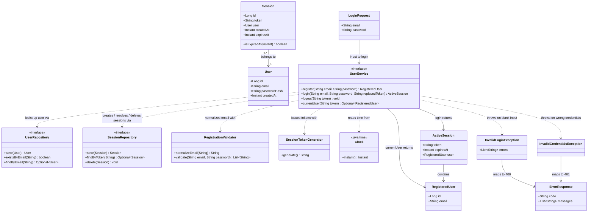

# User Login & Logout (email + password) — cookie-backed server-side session, HTML page + RESTful API

## Requirements

Implement login and logout for already-registered users: a person proves their identity with the same email and password they registered with, receives a logged-in state carried by an HttpOnly cookie, and can end that state again. Model "logged in" as an explicit, server-owned **Session** referenced by an opaque random token, so that the login/logout/query state machine lives entirely behind the existing `UserService` contract and can be exercised by Hegel property-based tests without a Spring context. Provide a separate static login page that asks the server which state the browser is in and offers exactly the action that is valid in that state (log in when logged out, log out when logged in). Keep the 100% line + branch coverage gate on the `user` domain package green.

Decisions adopted from the analysis (unconfirmed by the stakeholder, therefore stated explicitly and easy to change):

- One page (`login.html`) with two states, separate from the registration page.
- Login while already logged in succeeds and **rotates** the session: the presented session is invalidated only after successful authentication.
- Logout is **idempotent**: with no cookie, an unknown token or an already-ended session it still succeeds and clears the cookie.
- Sessions have a fixed server-side lifetime of **12 hours**; the boundary is exclusive (a session presented exactly at its expiry instant is expired).
- A user may hold several independent sessions; logout ends only the presented one.
- The cookie carries only the opaque token (HttpOnly, SameSite=Strict, Path=/, browser-session lifetime, no `Secure` because the showcase runs on plain `http://localhost`).
- Registration does **not** log the user in; `register.html` is unchanged.
- The logged-in view shows the user's email and a logout button, nothing else.
- Wrong credentials, unknown email and wrong password alike, yield one uniform `401` failure.
- Blank/missing login fields yield a `400` validation error, reusing the registration message texts; the registration password policy is **not** applied at login.

Boundaries: no Spring Security, no servlet `HttpSession`, no JWT, no password reset, no "remember me", no session listing, no CSRF token machinery beyond the SameSite cookie, no changes to the registration rules or API, no new Gradle dependencies.

## Entities

Existing types (`User`, `UserRepository`, `RegistrationValidator`, `RegisteredUser`, `ErrorResponse`, `InvalidRegistrationException`, `EmailAlreadyRegisteredException`, `RegistrationRequest`, `RegistrationController`) are **not modified** except where an Operation below says so. `RegisteredUser` is reused as the "who is logged in" projection instead of introducing a new DTO.

## Approach

1. Session model and API design:
   - "Logged in" is a row in a new `sessions` table: an opaque 256-bit random token (Base64 URL-safe, 43 characters, unique), the owning `User`, `createdAt` and `expiresAt`. The cookie is only a pointer to that row; the server never trusts the cookie's presence, it resolves the token.
   - Three new `UserService` actions, mirroring the three things the page needs: `login` (authenticate, optionally invalidate a presented session, create a fresh one), `logout` (delete the presented session if it exists), `currentUser` (resolve a token to the logged-in user, treating missing/unknown/expired as logged out and deleting expired rows lazily).
   - REST surface under `/api/session`: `POST` (login → `201` + `Set-Cookie`), `DELETE` (logout → `204` + cookie cleared, idempotent), `GET` (`200` with the user when logged in, `204` when not). The token travels only in the `SESSION` cookie, never in a JSON body.
   - The static page `login.html` follows `register.html` exactly (same styling, vanilla `fetch`, unified error rendering): on load it calls `GET /api/session` to pick the logged-out or logged-in view, and re-renders after each action.

2. Technical implementation:
   - No new dependencies. Spring Data JPA + H2 persist `Session`; `spring-security-crypto` supplies `PasswordEncoder.matches`; `java.security.SecureRandom` generates tokens; `java.time.Clock` (a new `@Bean`) supplies time so the service becomes deterministic in tests. `UserServiceImpl.register` switches from `Instant.now()` to the injected clock (behavior-preserving).
   - Cookies are written with Spring's `ResponseCookie` (`HttpOnly`, `SameSite=Strict`, `Path=/`, no `Max-Age` for login; `Max-Age=0` for logout) and read with `@CookieValue(required = false)`.
   - Exception handling: two new business exceptions, both translated by the existing `GlobalExceptionHandler` into the existing `ErrorResponse(code, messages)` shape — `InvalidLoginException` → `400 VALIDATION_ERROR`, `InvalidCredentialsException` → `401 INVALID_CREDENTIALS`. Controllers never build error bodies.
   - Timing side-channel mitigation: when the email is unknown the service still performs one BCrypt `matches` against a placeholder hash computed once at construction, so unknown-email and wrong-password requests do comparable work.
   - Token collisions (2⁻²⁵⁶) are not handled; the unique constraint would surface them as a `500`, which is acceptable.

3. Business logic and testing:
   - Login normalizes exactly like registration (`RegistrationValidator.normalizeEmail` for the email, `strip()` for the password) so any user who could register can log in with case/whitespace variants of their credentials — the central Hegel round-trip property.
   - Validation at login is limited to non-blank email and non-blank password; all other failures collapse into one uniform "Invalid email or password".
   - Expiry is computed once at login (`createdAt + 12h`) and checked on every resolution with an exclusive boundary; expired rows are deleted when encountered.
   - Hegel properties on the service (fresh in-memory user + session fakes, `MutableClock`, BCrypt strength 4, no Spring) cover: round-trip login under normalization variants, uniform rejection of wrong password / unknown email, logout invalidation and idempotency, unknown/garbage tokens, exact expiry boundary, session rotation, independence of concurrent sessions, token uniqueness/shape, blank-input validation, and a **model-based action-sequence property** (random interleavings of login / logout / query / time-advance checked against a `Set<String>` of live tokens). HTTP + cookie wiring is example-based with `MockMvcTester`, as `RegistrationApiTest` is today.

## Structure

### Inheritance Relationships
1. `UserService` interface (existing) gains `login`, `logout`, `currentUser`; `UserServiceImpl` (existing) implements all four methods.
2. `SessionRepository` interface extends Spring Data's bare `Repository<Session, Long>` marker (same style as `UserRepository`); Spring Data implements it at runtime, `InMemorySessionRepository` implements it in tests.
3. `Session` is a JPA `@Entity` (no base class), owning a `@ManyToOne` to `User`.
4. `InvalidLoginException extends RuntimeException`; `InvalidCredentialsException extends RuntimeException`.
5. `ActiveSession`, `LoginRequest` are Java records; `RegisteredUser` (existing record) is reused.
6. `MutableClock extends java.time.Clock` (test support only).

### Dependencies
1. `SessionController` injects `UserService` only.
2. `UserServiceImpl` injects `UserRepository`, `SessionRepository`, `RegistrationValidator`, `PasswordEncoder`, `SessionTokenGenerator`, `Clock`.
3. `SessionTokenGenerator` depends on `java.security.SecureRandom` and `java.util.Base64` only.
4. `GlobalExceptionHandler` handles `InvalidLoginException` and `InvalidCredentialsException` in addition to the existing ones.
5. `ClockConfig` provides the `Clock` bean; `PasswordConfig` (existing) keeps providing `PasswordEncoder`.
6. `login.html` calls `GET/POST/DELETE /api/session`; it never reads the cookie itself.

### Layered Architecture
1. Static page layer: `static/login.html` — presentation and state switching only; no business rules.
2. Controller layer: `user.web.SessionController` — maps HTTP + cookie ↔ service calls; sets/clears the `SESSION` cookie; contains no authentication logic.
3. Service layer: `user.UserService` / `UserServiceImpl` — normalization, credential verification, session issue/rotate/resolve/expire/delete; transactional boundary.
4. Repository layer: `user.UserRepository` (unchanged), `user.SessionRepository` (new) — narrow contracts, Spring Data implemented.
5. Data access / persistence: JPA entities `User` (unchanged) and `Session` (new) on in-memory H2; `sessions.token` unique.
6. Infrastructure config: `config.PasswordConfig` (existing), `config.ClockConfig` (new).
7. Exception handling layer: `user.web.GlobalExceptionHandler` — unified translation of all four business exceptions to `ErrorResponse`.

## Operations

Execute in this order; each operation lists its completion criterion.

### Operation 1 — Create Configuration - `config.ClockConfig`
1. Responsibility: expose the system time source as a bean so domain code never calls `Instant.now()` directly.
2. Methods:
   - `clock(): Clock` — returns `Clock.systemUTC()`.
3. Annotations: `@Configuration` on the class, `@Bean` on the method.
4. Constraints: lives in `com.antithesis.springhegel.config` (outside the coverage gate, like `PasswordConfig`). Done when the application context loads with exactly one `Clock` bean.

### Operation 2 — Create Business Exception - `user.InvalidCredentialsException`
1. Inheritance: `extends RuntimeException`.
2. Attributes: none — deliberately carries neither the email nor which check failed.
3. Constructors: no-arg, calling `super("Invalid email or password")`.
4. Usage: thrown by `UserServiceImpl.login` when the normalized email is unknown **or** the password does not match. Javadoc must state that both causes are intentionally indistinguishable.

### Operation 3 — Create Business Exception - `user.InvalidLoginException`
1. Inheritance: `extends RuntimeException`.
2. Attributes:
   - `errors: List<String>` — every failing rule's message (immutable copy).
3. Constructors: `InvalidLoginException(List<String> errors)` calling `super(String.join("; ", errors))` and storing `List.copyOf(errors)`.
4. Methods: `getErrors(): List<String>`.
5. Usage: thrown by `UserServiceImpl.login` when the normalized email and/or the trimmed password is blank. Mirrors `InvalidRegistrationException` shape; do not merge the two classes.

### Operation 4 — Create Entity - `user.Session`
1. Responsibility: persistent record that one user is logged in through one token.
2. Attributes:
   - `id: Long` — `@Id @GeneratedValue(strategy = GenerationType.IDENTITY)`
   - `token: String` — `@Column(nullable = false, unique = true, length = 43)`
   - `user: User` — `@ManyToOne(optional = false) @JoinColumn(name = "user_id", nullable = false)` (default eager fetch; keep it, `open-in-view=false` plus eager load means the email is available after the transaction)
   - `createdAt: Instant` — `@Column(nullable = false)`
   - `expiresAt: Instant` — `@Column(nullable = false)`
3. Methods:
   - `protected Session()` — JPA only.
   - `Session(String token, User user, Instant createdAt, Instant expiresAt)` — public constructor.
   - getters for all five fields.
   - `isExpiredAt(Instant now): boolean` — returns `!now.isBefore(expiresAt)` (exclusive boundary: expired when `now >= expiresAt`).
   - `toString()` — `"Session[id=…, userId=…, createdAt=…, expiresAt=…]"`; the token is intentionally omitted (comment this, as `User.toString` does for the hash).
4. Annotations: `@Entity`, `@Table(name = "sessions")`.
5. Constraints: no H2-specific constructs; the token is never logged or printed. Done when Hibernate creates `sessions` with a unique index on `token` and a FK to `users`.

### Operation 5 — Create Repository - `user.SessionRepository`
1. Responsibility: narrow data-access contract for `Session`.
2. Interface: `public interface SessionRepository extends Repository<Session, Long>` with exactly:
   - `Session save(Session session)`
   - `Optional<Session> findByToken(String token)`
   - `void delete(Session session)`
3. Constraints: import `org.springframework.data.repository.Repository` (not `JpaRepository`/`CrudRepository`), Javadoc explaining the narrowness as in `UserRepository`. Done when Spring Data creates the proxy at startup and the three methods are the whole surface.

### Operation 6 — Create Domain Component - `user.SessionTokenGenerator`
1. Responsibility: produce unguessable, URL-safe session tokens.
2. Attributes:
   - `TOKEN_BYTES: int = 32` (static final)
   - `random: SecureRandom` — created in the constructor.
3. Methods:
   - `generate(): String` — fill a 32-byte array from `random`, return `Base64.getUrlEncoder().withoutPadding().encodeToString(bytes)` (always 43 characters from the alphabet `[A-Za-z0-9_-]`).
4. Annotations: `@Component`.
5. Constraints: no configurable length, no `Random`/`ThreadLocalRandom`. Javadoc documents the 43-character shape (tests assert it). Done when two calls never return equal strings in the property test.

### Operation 7 — Create DTO - `user.ActiveSession`
1. Responsibility: result of a successful login — what the web layer needs to set the cookie and answer the page.
2. Definition: `public record ActiveSession(String token, Instant expiresAt, RegisteredUser user)`.
3. Methods: override `toString()` to `"ActiveSession[expiresAt=…, user=…]"` — the token is **redacted** so the record can never leak it through logging.
4. Constraints: the web layer must never serialize this record to JSON; it serializes `user()` only.

### Operation 8 — Update Service Interface - `user.UserService`
1. Update the class Javadoc to "Business contract for registering users and managing their login sessions."
2. Keep `register` unchanged.
3. Add:
   - `ActiveSession login(String email, String password, String replacedToken)`
     - Javadoc: `email`/`password` may be `null` or padded and are normalized exactly like `register` (email trimmed + lowercased, password stripped). `replacedToken` may be `null`; when non-null and it identifies an existing session, that session is deleted **after** successful authentication (session rotation). Returns a fresh session valid for `SESSION_LIFETIME`.
     - `@throws InvalidLoginException` if the normalized email or trimmed password is blank.
     - `@throws InvalidCredentialsException` if the email is unknown or the password does not match (indistinguishable).
   - `void logout(String token)`
     - Javadoc: ends the session identified by `token`. `null`, unknown, expired or already-ended tokens are silently ignored (idempotent). Never throws for any input.
   - `Optional<RegisteredUser> currentUser(String token)`
     - Javadoc: resolves `token` to the logged-in user. Returns empty for `null`, unknown or expired tokens; an expired session encountered here is deleted. Never throws for any input.
4. Constraints: no other methods; no `Session` entity in the signature.

### Operation 9 — Update Service Implementation - `user.UserServiceImpl`
1. Dependency injection (constructor, final fields, in this order): `UserRepository userRepository`, `SessionRepository sessionRepository`, `RegistrationValidator validator`, `PasswordEncoder passwordEncoder`, `SessionTokenGenerator tokenGenerator`, `Clock clock`.
2. Attributes:
   - `static final Duration SESSION_LIFETIME = Duration.ofHours(12)` (package-private so tests reference it).
   - `static final String EMAIL_BLANK = "Email must not be blank"`, `PASSWORD_BLANK = "Password must not be blank"` — same texts as `RegistrationValidator`; either reference constants there or duplicate the literals verbatim (do not change `RegistrationValidator`'s messages).
   - `private final String unknownUserHash` — computed in the constructor as `passwordEncoder.encode("unknown-user-placeholder")`; used to equalize work when the email is unknown.
3. `register` — unchanged except `Instant.now()` becomes `clock.instant()`.
4. `login(email, password, replacedToken)` — `@Transactional`:
   - Input normalization: `normalizedEmail = validator.normalizeEmail(email)`; `trimmedPassword = password == null ? "" : password.strip()`.
   - Validation: collect `EMAIL_BLANK` if `normalizedEmail.isBlank()`, `PASSWORD_BLANK` if `trimmedPassword.isBlank()`; if the list is non-empty throw `InvalidLoginException(errors)`.
   - Authentication: `Optional<User> user = userRepository.findByEmail(normalizedEmail)`; `String hash = user.map(User::getPasswordHash).orElse(unknownUserHash)`; `boolean matches = passwordEncoder.matches(trimmedPassword, hash)`; if `user.isEmpty() || !matches` throw `InvalidCredentialsException`. (Always run `matches` before deciding, so unknown-email and wrong-password requests do comparable work.)
   - Rotation: if `replacedToken != null`, `sessionRepository.findByToken(replacedToken).ifPresent(sessionRepository::delete)`.
   - Issue: `Instant now = clock.instant()`; `Session saved = sessionRepository.save(new Session(tokenGenerator.generate(), user.get(), now, now.plus(SESSION_LIFETIME)))`.
   - Return: `new ActiveSession(saved.getToken(), saved.getExpiresAt(), new RegisteredUser(user.get().getId(), user.get().getEmail()))`.
5. `logout(token)` — `@Transactional`: if `token == null` return; `sessionRepository.findByToken(token).ifPresent(sessionRepository::delete)`.
6. `currentUser(token)` — `@Transactional`: if `token == null` return `Optional.empty()`; `Optional<Session> session = sessionRepository.findByToken(token)`; if empty return empty; if `session.get().isExpiredAt(clock.instant())` delete it and return empty; else return `Optional.of(new RegisteredUser(user.getId(), user.getEmail()))`.
7. Constraints: no logging; the token appears in no exception message; every conditional branch above has a corresponding Hegel property or example test in Operations 16–17 (100% branch coverage is enforced).

### Operation 10 — Create Web DTO - `user.web.LoginRequest`; update `ErrorResponse` Javadoc
1. `public record LoginRequest(String email, String password)` with `toString()` overridden to `"LoginRequest[email=…, password=REDACTED]"` (same reason and shape as `RegistrationRequest`).
2. Update `ErrorResponse`'s Javadoc so `code` is documented as one of `VALIDATION_ERROR`, `EMAIL_ALREADY_REGISTERED`, `INVALID_CREDENTIALS`. No structural change.

### Operation 11 — Update Exception Handler - `user.web.GlobalExceptionHandler`
1. Add constant `static final String INVALID_CREDENTIALS = "INVALID_CREDENTIALS"`.
2. Add handlers:
   - `handleInvalidLogin(InvalidLoginException ex): ResponseEntity<ErrorResponse>` → `400 BAD_REQUEST`, `ErrorResponse(VALIDATION_ERROR, ex.getErrors())`.
   - `handleInvalidCredentials(InvalidCredentialsException ex): ResponseEntity<ErrorResponse>` → `401 UNAUTHORIZED`, `ErrorResponse(INVALID_CREDENTIALS, List.of("Invalid email or password"))`.
3. Existing handlers unchanged. Do not add a `WWW-Authenticate` header (no HTTP auth scheme is in use).

### Operation 12 — Create Controller - `user.web.SessionController`
1. Responsibility: HTTP + cookie adapter for login / logout / current-session; no business logic.
2. Attributes:
   - `static final String SESSION_COOKIE = "SESSION"` (package-private, tests reference it).
   - `private final UserService userService` (constructor injection).
3. Methods (class annotated `@RestController`, `@RequestMapping("/api/session")`):
   - `login(@RequestBody LoginRequest request, @CookieValue(name = SESSION_COOKIE, required = false) String presentedToken): ResponseEntity<RegisteredUser>` — `@PostMapping`. Calls `userService.login(request.email(), request.password(), presentedToken)`. Responds `201 CREATED`, header `Set-Cookie` built with `ResponseCookie.from(SESSION_COOKIE, session.token()).httpOnly(true).sameSite("Strict").path("/").build()` (no `maxAge` → browser-session cookie; no `secure` — see Safeguards), body `session.user()`.
   - `logout(@CookieValue(name = SESSION_COOKIE, required = false) String token): ResponseEntity<Void>` — `@DeleteMapping`. Calls `userService.logout(token)`. Responds `204 NO_CONTENT` with `Set-Cookie` clearing the cookie: `ResponseCookie.from(SESSION_COOKIE, "").httpOnly(true).sameSite("Strict").path("/").maxAge(0).build()`. Always, regardless of whether a session existed.
   - `current(@CookieValue(name = SESSION_COOKIE, required = false) String token): ResponseEntity<RegisteredUser>` — `@GetMapping`. `userService.currentUser(token)` → `200 OK` with the user, or `204 NO_CONTENT` with no body when empty.
4. Constraints: the token never appears in a response body; `ActiveSession` is never returned directly.

### Operation 13 — Create Static Page - `src/main/resources/static/login.html`
1. Copy the structure and `<style>` of `register.html`; title "Log in"; `<h1>` "Log in to your account".
2. Markup:
   - `<form id="login-form" novalidate>` with `email` (`autocomplete="email"`) and `password` (`autocomplete="current-password"`) inputs, a "Log in" submit button, `<ul id="errors" hidden>`, and a paragraph linking to `register.html` ("Don't have an account? Register").
   - `<section id="logged-in" hidden>`: `<h2>You are logged in</h2>`, `
Logged in as <strong id="current-email"></strong>.
`, `<button id="logout-button" type="button">Log out</button>`.
   - Both containers start hidden; a `
Checking your session…
` is shown until the first state check completes.
3. Script (vanilla, no libraries):
   - `refreshState()`: `fetch('/api/session')`; on `200` parse JSON and call `showLoggedIn(user.email)`; on any other status or a network error call `showLoggedOut()`. Called once on load.
   - Form submit: prevent default, clear errors, `POST /api/session` with JSON `{email, password}`; on `response.ok` parse the body and `showLoggedIn(user.email)`, reset the form; otherwise render `error.messages` (fallback "Login failed."), same `showErrors` helper as `register.html`; network error → "Could not reach the server. Please try again."
   - Logout click: `DELETE /api/session` (ignore the response body), then `showLoggedOut()`.
   - `showLoggedIn(email)` / `showLoggedOut()` toggle `hidden` on the form and the section and hide `#loading`.
4. Constraints: the script never touches `document.cookie`; `fetch` uses default same-origin credentials. Done when the page is served at `/login.html` and switches views against the running app.

### Operation 14 — Create Test Support - `user.InMemorySessionRepository`, `user.MutableClock` (in `src/test/java`)
1. `InMemorySessionRepository implements SessionRepository` (final, package-private):
   - `Map<String, Session> byToken`, `long nextId = 1`.
   - `save`: if `byToken` already contains the token throw `DataIntegrityViolationException("duplicate token")`; set `id` via `ReflectionTestUtils.setField`; store; return the session.
   - `findByToken`: `Optional.ofNullable(byToken.get(token))`.
   - `delete`: `byToken.remove(session.getToken())`.
   - `int size()`, `boolean containsToken(String)` helpers.
2. `MutableClock extends Clock` (final, package-private):
   - `private Instant now`; constructor `MutableClock(Instant start)`; `instant()` returns `now`; `getZone()` returns `ZoneOffset.UTC`; `withZone(ZoneId)` returns `this`; `advance(Duration d)` sets `now = now.plus(d)`.
3. Constraints: no Spring context; a fresh instance per Hegel draw.

### Operation 15 — Update `user.UserServicePropertyTest` fixture
1. Replace the private `Fixture` record with a shared, package-private test record `user.ServiceFixture(InMemoryUserRepository repository, InMemorySessionRepository sessions, MutableClock clock, UserService service)` (own file in `src/test/java`), holding `static final PasswordEncoder ENCODER = new BCryptPasswordEncoder(4)` and `static final Instant START = Instant.parse("2026-09-03T12:00:00Z")`; `fresh()` builds `new UserServiceImpl(repository, sessions, new RegistrationValidator(), ENCODER, new SessionTokenGenerator(), new MutableClock(START))`. Both service property test classes use it.
2. Update the anonymous racing repository test to pass a fresh `InMemorySessionRepository`, `new SessionTokenGenerator()` and a `MutableClock` to the constructor.
3. Add one property: `registeredUserCreatedAtComesFromTheClock` — register, assert `createdAt` equals `clock.instant()`.
4. All existing assertions stay unchanged and must still pass.

### Operation 16 — Create Hegel Property Tests - `user.UserServiceLoginPropertyTest`
Uses the shared `ServiceFixture` from Operation 15 (fresh instance inside every test body; no state shared between draws). BCrypt strength 4. Reuse `EmailPasswordGenerators` (`validEmails`, `validPasswords`, `randomizeCase`, `blankStrings`) and add there a generator `tokensLike()` = `fromRegex("[A-Za-z0-9_-]{43}").fullmatch(true)` for forged tokens. Each test body registers its own users.

Properties (`@HegelTest`, `TestCase tc`):
1. `registeredUserCanLogInWithNormalizationVariants` — register `(e, p)`; login with `pad(randomizeCase(e))`, `pad(p)`, `null` replacedToken → `ActiveSession` whose `user().email()` equals `e`, `expiresAt == clock.instant() + SESSION_LIFETIME`, `token` matches `[A-Za-z0-9_-]{43}`; `session.toString()` does not contain the token (redaction, and it keeps `ActiveSession.toString` under the coverage gate); `currentUser(token)` is present with the same id/email; `sessions.size() == 1`.
2. `wrongPasswordIsRejectedWithTheUniformFailure` — register `(e, p)`; draw `other` from `validPasswords()` with `assume`/filter `!other.equals(p)`; login → `InvalidCredentialsException` with message exactly `"Invalid email or password"`; `sessions.size() == 0`.
3. `unknownEmailIsRejectedWithTheUniformFailure` — no registration (or a different registered user); login with a drawn valid email and password → same exception, same message; `sessions.size() == 0`.
4. `logoutInvalidatesTheTokenAndIsIdempotent` — register + login; `logout(token)`; `currentUser(token)` empty; `sessions.size() == 0`; `logout(token)` again does not throw and size stays 0.
5. `unknownTokensAreNeverLoggedIn` — draw a forged token from `tokensLike()` (and arbitrary `text()`); with and without a registered+logged-in user, `currentUser(forged)` is empty and `logout(forged)` does not throw or change `sessions.size()`.
6. `sessionExpiresExactlyAtItsLifetime` — register + login at `t0`; draw `lead` in `[1 ms, 12 h − 1 ms]`; `clock.advance(SESSION_LIFETIME − lead)` → present; advance by `lead` (now exactly `expiresAt`) → empty **and** `sessions.size() == 0` (expired row deleted); a later `currentUser` stays empty.
7. `loginWithAPresentedSessionRotatesIt` — register + login → `t1`; login again with `replacedToken = t1` → `t2 != t1`; `currentUser(t1)` empty; `currentUser(t2)` present; `sessions.size() == 1`.
8. `loginWithAnUnknownReplacedTokenStillSucceeds` — register; login with `replacedToken` drawn from `tokensLike()` → success; `sessions.size() == 1`.
9. `failedLoginDoesNotTouchThePresentedSession` — register + login → `t1`; login with a wrong password and `replacedToken = t1` → `InvalidCredentialsException`; `currentUser(t1)` still present.
10. `concurrentSessionsAreIndependent` — register; login `n` times (`n` in 2..5) with `null` replacedToken → `n` distinct tokens, all present; logout one drawn index → that one empty, the others present; `sessions.size() == n − 1`.
11. `blankCredentialsAreAValidationError` — draw `blankEmail` from `blankStrings()` and a valid password → `InvalidLoginException` with errors exactly `["Email must not be blank"]`; valid email + blank password → exactly `["Password must not be blank"]`; both blank → both messages in that order; `sessions.size() == 0`; also assert `null` email / `null` password produce the same messages.
12. `sessionToStringOmitsTheToken` — register + login; fetch the `Session` via `sessions.findByToken(token)`; `toString()` starts with `"Session["`, contains the session id and the user id, does **not** contain the token; `getId()` is non-null and the other getters return the constructor values; `isExpiredAt(expiresAt.minusNanos(1))` is false and `isExpiredAt(expiresAt)` is true.
13. `randomActionSequencesAgreeWithTheModel` — register one user; draw a list of 1–15 actions from `sampledFrom(LOGIN, LOGOUT_LIVE, LOGOUT_STALE, QUERY, ADVANCE_PAST_EXPIRY)`; keep `List<String> issued` and `Set<String> live`; LOGIN: `login(e, p, null)` → add token to both; LOGOUT_LIVE: if `live` non-empty draw one, `logout`, remove from `live`; LOGOUT_STALE: draw from `issued − live` if non-empty, `logout` (no model change); QUERY: for every issued token assert `currentUser(t).isPresent() == live.contains(t)`; ADVANCE_PAST_EXPIRY: `clock.advance(SESSION_LIFETIME)` and clear `live`. After the sequence run the QUERY check once more.

Example tests (`@Test`, no input space):
- `nullTokenIsNotLoggedInAndLogoutOfNullIsANoOp`.
- `tokenGeneratorProducesDistinctUrlSafeTokens` — 1 000 calls to `new SessionTokenGenerator().generate()`, all distinct, all matching `[A-Za-z0-9_-]{43}`.

### Operation 17 — Create API Wiring Tests - `user.web.SessionApiTest`, `user.web.LoginRequestTest`
1. `SessionApiTest` — `@SpringBootTest @AutoConfigureMockMvc`, `MockMvcTester mvc`; a helper `register(email, password)` posting to `/api/users`, a helper `login(email, password)` posting JSON to `/api/session` and returning the `MvcTestResult`; extract the cookie with `result.getResponse().getCookie("SESSION")` (`jakarta.servlet.http.Cookie`). Each test uses its own email (shared H2 across tests).
   - `loginReturns201TheUserAndAnHttpOnlyCookie` — `201`, `$.email` normalized, `$.id` not null; response contains no `token` field; cookie present, `isHttpOnly()`, path `/`, `Set-Cookie` header contains `SameSite=Strict`, no `Max-Age`.
   - `currentSessionReturnsTheUserWhenTheCookieIsValid` — login, then `GET /api/session` with the cookie → `200`, `$.email`. (This also exercises Hibernate's no-arg `Session` constructor.)
   - `currentSessionReturns204WithoutACookieOrWithAForgedOne` — no cookie → `204`; cookie `SESSION=forged` → `204`, empty body.
   - `logoutClearsTheCookieAndInvalidatesTheSession` — login; `DELETE /api/session` with cookie → `204`, `Set-Cookie` with `Max-Age=0`; `GET` with the old cookie → `204`.
   - `logoutWithoutASessionIsIdempotent` — `DELETE` without cookie → `204` and cookie-clearing header.
   - `wrongPasswordReturns401InvalidCredentials` — registered user, wrong password → `401`, `$.code == "INVALID_CREDENTIALS"`, `$.messages == ["Invalid email or password"]`; unknown email → identical status/body.
   - `blankCredentialsReturn400ValidationError` — `{"email":" ","password":" "}` → `400`, `VALIDATION_ERROR`, both blank messages.
   - `loginWhileLoggedInRotatesTheCookie` — login twice, second with the first cookie → different cookie value; `GET` with the first → `204`, with the second → `200`.
   - `loginPageIsServed` — `GET /login.html` → `200`.
2. `LoginRequestTest.toStringRedactsThePassword` — same shape as `RegistrationRequestTest`.

### Operation 18 — Update Documentation - `README.md`
1. Under "Getting started", after the registration URL add: `http://localhost:8080/login.html` — "log in with a registered account; the page calls `POST/GET/DELETE /api/session` and the session travels in an HttpOnly `SESSION` cookie."
2. In "How the tests are shaped" add one bullet: sessions are a second narrow repository with a hand-written in-memory fake, time comes from an injected `Clock` so expiry is a deterministic property, and the login/logout state machine is checked with a model-based Hegel property.

### Operation 19 — Verify
1. `./gradlew build` passes: compilation, all Hegel and JUnit tests, `jacocoTestCoverageVerification` at 100% line and branch for `com.antithesis.springhegel.user.*` excluding `user.web.*` (now including `Session`, `SessionRepository`, `SessionTokenGenerator`, `ActiveSession`, both new exceptions and the enlarged `UserServiceImpl`).
2. `./gradlew bootRun`, open `/register.html`, register, open `/login.html`: the form is shown; log in → the logged-in view shows the email; reload → still logged in; log out → the form returns; reload → still the form.
3. Registration behavior and `RegistrationApiTest` unchanged.

## Norms

1. Annotation Standards: `@RestController` + `@RequestMapping` on controllers; `@Service` on service implementations; `@Component` on domain components; `@Configuration` + `@Bean` for infrastructure beans; `@Entity` + explicit `@Table(name = ...)` on entities; `@RestControllerAdvice` + `@ExceptionHandler` for error translation; `@Transactional` on all three new service methods (`currentUser` deletes expired rows, so it is not read-only).
2. Dependency Injection: constructor injection only, `final` fields, no field `@Autowired` (single-constructor classes need no annotation). Controllers depend on the `UserService` interface, never on `UserServiceImpl`. Time is obtained only through the injected `Clock`; `Instant.now()` is forbidden in `user.*`.
3. Exception Handling: business exceptions extend `RuntimeException`, are named after the business condition, and carry only what the response needs — `InvalidCredentialsException` carries nothing, `InvalidLoginException` carries the message list. All business exceptions are translated by `GlobalExceptionHandler` into `ErrorResponse(code, messages)`; services and controllers never build HTTP error responses themselves. Unknown/garbage tokens are not exceptions — they are the empty case.
4. Data Validation: login validation is limited to blank checks performed in `UserServiceImpl.login` using `RegistrationValidator.normalizeEmail` for normalization; the password policy in `RegistrationValidator.validate` is **not** called at login. No bean-validation annotations.
5. Logging: no logger is introduced. Should one be added later, it must never log passwords, session tokens, cookies, or full request bodies; `LoginRequest.toString`, `ActiveSession.toString` and `Session.toString` are redacted for this reason.
6. Documentation Standards: Javadoc on every new `UserService` method (contract, null handling, exceptions), on `SessionRepository`, `SessionTokenGenerator.generate` (token shape) and `Session.isExpiredAt` (boundary). Comments only for constraints the code cannot express (redaction, work-equalizing hash).
7. Testing Norms: Hegel `@HegelTest` + `TestCase tc` + `tc.draw(generator, "label")` is the primary style for all domain logic; each test body builds a fresh `InMemoryUserRepository`, `InMemorySessionRepository`, `MutableClock` and service — no Spring context, no state shared between draws. Plain JUnit `@Test` only for MockMvc wiring, `toString` redaction, null inputs and the token generator's distinctness check. API tests use unique emails per test because the H2 database and Spring context are shared.
8. Naming: the cookie is `SESSION`; the REST resource is `/api/session`; error code `INVALID_CREDENTIALS`; message `"Invalid email or password"`. Package placement: domain in `com.antithesis.springhegel.user`, HTTP in `user.web`, beans in `config`.

## Safeguards

1. Functional Constraints: the new API surface is exactly `POST /api/session`, `DELETE /api/session`, `GET /api/session` and the static `/login.html`. No password reset, no "remember me", no session listing, no auto-login on registration, no changes to `POST /api/users` or `register.html`.
2. Security Constraints:
   - The session token is a 32-byte `SecureRandom` value, Base64-URL encoded without padding (43 chars). It appears only in the `SESSION` cookie and the database; never in JSON bodies, logs, exception messages or `toString()` output.
   - Cookie attributes: `HttpOnly`, `SameSite=Strict`, `Path=/`, no `Max-Age` on login; `Max-Age=0` on logout. `Secure` is intentionally omitted because the showcase runs on `http://localhost`; a comment in `SessionController` must say so and that production deployments behind HTTPS should add it.
   - Login rotates the presented session only after successful authentication; a failed login never alters existing sessions.
   - Unknown email and wrong password are indistinguishable (same status, code, message) and perform comparable work (a BCrypt `matches` runs in both cases).
   - Plaintext passwords are never persisted, logged or echoed; `LoginRequest.toString` redacts the password.
   - Do NOT add `spring-boot-starter-security`; do NOT use `HttpSession`; do NOT read `document.cookie` in the page.
   - CSRF: state-changing endpoints are protected by the `SameSite=Strict` cookie and JSON request bodies; no token machinery is added.
3. Business Rule Constraints (exact, testable):
   - Login normalization: email → `RegistrationValidator.normalizeEmail` (strip + `Locale.ROOT` lowercase); password → `strip()`; `null` → `""`.
   - Login succeeds iff `userRepository.findByEmail(normalizedEmail)` is present **and** `passwordEncoder.matches(trimmedPassword, user.passwordHash)` is true.
   - Session lifetime is exactly `Duration.ofHours(12)` from `clock.instant()` at login; a session is expired iff `!now.isBefore(expiresAt)`; expired sessions resolve to "not logged in" and are deleted when encountered.
   - Logout of `null`, unknown, expired or already-ended tokens is a silent no-op.
   - Multiple live sessions per user are allowed; logout affects only the presented token; login with `replacedToken` deletes only that token's session.
4. Exception Handling Constraints: exactly two new business exceptions (`InvalidLoginException`, `InvalidCredentialsException`); both handled exclusively by `GlobalExceptionHandler`; existing handlers and codes unchanged.
5. Exact Error Messages (do not modify):
   - `"Email must not be blank"` (blank email at login — same text as registration)
   - `"Password must not be blank"` (blank password at login — same text as registration)
   - `"Invalid email or password"` (unknown email **or** wrong password)
6. API Constraints:
   - `POST /api/session` success = `201 Created`, `Set-Cookie: SESSION=<token>; Path=/; HttpOnly; SameSite=Strict`, body `{"id": <number>, "email": "<normalized email>"}`.
   - `POST /api/session` blank input = `400` `{"code": "VALIDATION_ERROR", "messages": [...]}`; wrong credentials = `401` `{"code": "INVALID_CREDENTIALS", "messages": ["Invalid email or password"]}`; malformed body = `400` `VALIDATION_ERROR` (existing handler).
   - `GET /api/session` = `200` with `{"id", "email"}` when logged in; `204` with empty body otherwise.
   - `DELETE /api/session` = `204` with `Set-Cookie: SESSION=; Path=/; Max-Age=0; HttpOnly; SameSite=Strict`, always.
7. Technical Constraints: no new Gradle dependencies; `SessionRepository` keeps its 3-method contract; `UserRepository` unchanged; entities free of H2-specific constructs; `Clock` is the only time source in `user.*`; Hegel JVM flags in `build.gradle.kts` untouched; `ClockConfig` lives in `config` (outside the coverage gate).
8. Data Constraints: `sessions.token` unique + not null (43 chars); `sessions.user_id` not null FK → `users.id`; `sessions.created_at`, `sessions.expires_at` not null; `expires_at == created_at + 12h` at insert.
9. Coverage Constraints: `jacocoTestCoverageVerification` continues to enforce 100% line AND branch coverage for `com.antithesis.springhegel.user.*` excluding `user.web.*`; the build fails otherwise. Every branch in `UserServiceImpl.login/logout/currentUser` and `Session.isExpiredAt` maps to a property in Operation 16; `Session`'s JPA no-arg constructor is covered by the Hibernate round-trip in Operation 17.

## Acceptance Criteria Traceability

| AC# | Description | Covered By |
|-----|-------------|-----------|
| 1 | Existing users can log in with the email and password used at registration | Operations 8, 9 (normalization identical to `register`), 12, 13; verified by Operation 16 #1 and Operation 17 |
| 2 | Logged-in users can log out | Operations 8, 9 (`logout`), 12 (`DELETE`), 13; verified by Operation 16 #4 and Operation 17 |
| 3 | A separate page for login/logout | Operation 13 (`login.html`), Operation 18; served check in Operation 17 |
| 4 | If logged out → can log in; if logged in → can log out | Operations 9 (`currentUser`), 12 (`GET`), 13 (state switch on load and after each action); Operation 16 #13 (state-machine model), Operation 17 |
| 5 | Cookies are used to check logged in / logged out | Operation 12 (`SESSION` cookie set/read/cleared), Safeguards 2 and 6; Operation 17 cookie assertions |
| 6 | Property-based tests with Hegel verify the behavior | Operations 15, 16 (13 properties incl. model-based sequences); Norms 7 |
| 7 | Reuse the existing `UserService`; add the new actions there | Operations 8, 9 (three new methods on the existing interface/implementation) |
| 8 | 100% line/branch coverage of `user.*` domain code (excluding `user.web`) | Operations 4–9 placed under the gate, Operations 15–17, Operation 19; Safeguards 9 |
